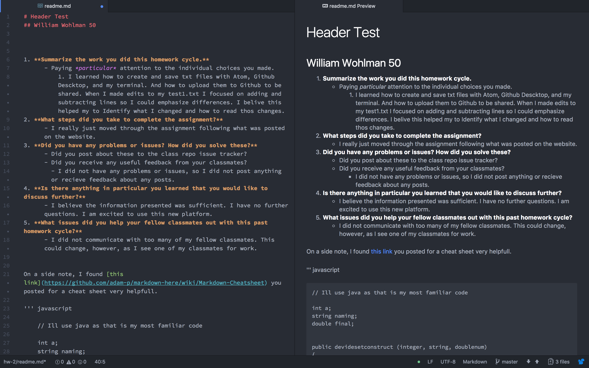

# Header Test
## William Wohlman 50


1. **Summarize the work you did this homework cycle.**
      - Paying *particular* attention to the individual choices you made.
          1. I learned how to create and save txt files with Atom, Github Descktop, and my terminal. Furthermore,I was informed on how to upload them to Github to be shared. When I made edits to my test1.txt I focused on adding and subtracting lines so I could emphasize differences. I belive this helped my to Identify what I changed and how to read those changes.
2. **What steps did you take to complete the assignment?**
      - I really just moved through the assignment by following what was posted on the website.
3. **Did you have any problems or issues? How did you solve these?**
      - Did you post about these to the class repo issue tracker?
      - Did you receive any useful feedback from your classmates?
        - I did not have any problems or issues, so I did not post anything or recieve feedback about any posts.
4. **Is there anything in particular you learned that you would like to discuss further?**
      - I believe the information presented was sufficient. I have no further questions. I am excited to use this new platform.
5. **What issues did you help your fellow classmates out with this past homework cycle?**
      - I did not communicate with too many of my fellow classmates. This could change, however, as I see one of my classmates at work.


On a side note, I found [this link](https://github.com/adam-p/markdown-here/wiki/Markdown-Cheatsheet) you posted as a cheat-sheet very helpfull.

``` javascript

    // Ill use java as that is my most familiar codeing language

    int a;
    string naming;
    double devisable;


    public devidesetconstruct (integer, string, doublenum)
    {
     a = integer;
     devisable = doublenum;
     naming = string;
    }
```


